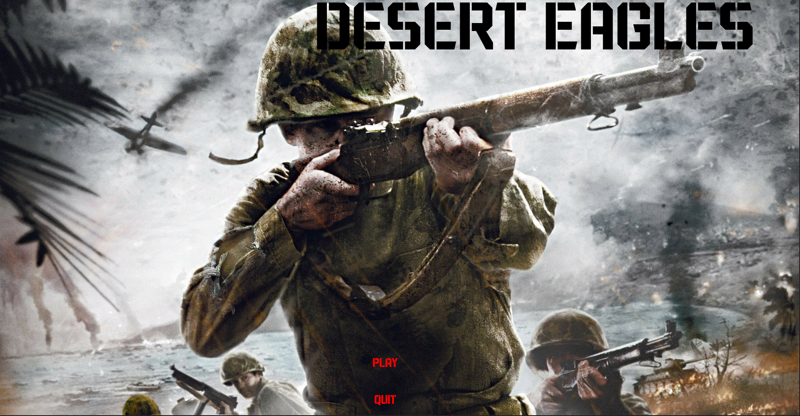
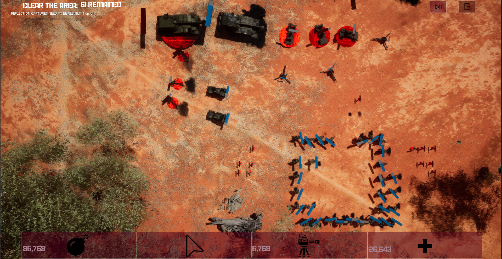

# Desert Eagles

## Description:
The code for a basic RTS game made in Unreal Engine 5

## Features:
All customizable:

- Enemies(Tanks, Turret, Soldier, Camion)
- Spawners(For any actor)
- UI for any character and Manager UI
- Units Manager
- Turret and Bomb spawner
- Combat System
- Enemy AI
  
## How to Use:
- Download the project
- Open with Unreal Engine 5.2.1

## Demonstration:

## Technologies Used:
-Unreal Engine 5.2.1

## Author:

This game was created by [Emanuele Pardini](http://emanuelepardini.altervista.org/).
Enjoy!
